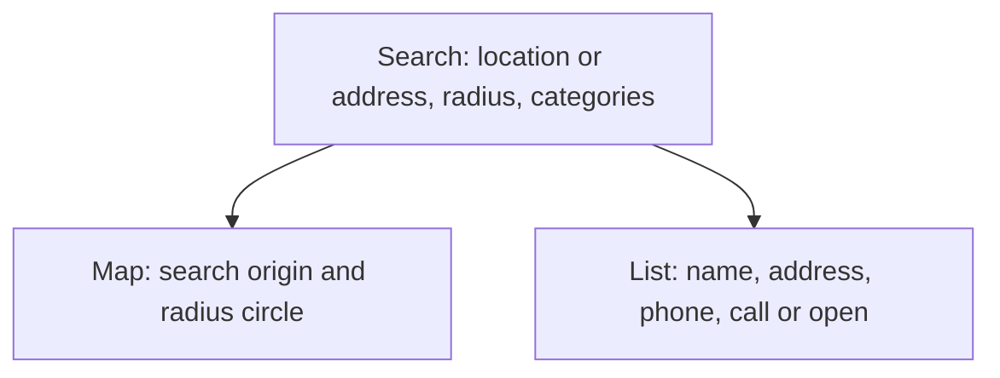
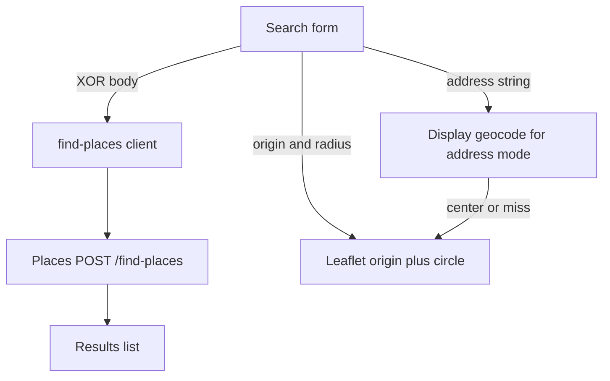

# Nearby Explorer - Plan

## Goal Capsule

- **Objective:** Ship a local browser nearby-explorer so the Places service owner can search nearby places and act on contact or map links without using curl.
- **Product authority:** This plan's Product Contract. The sibling Places HTTP service is an upstream dependency, not this plan's scope.
- **Open blockers:** None.
- **Execution profile:** Replace the Vite starter with a React 19 SPA. Call `POST /find-places` with `fetch`. Render a Leaflet search-area map. Prove the search contract with Vitest. Prove the map and geolocation by running the app.
- **Stop if:** Result pins, Places backend edits, a Google Maps JS key in the frontend, or a Vite proxy added only to solve CORS.
- **Product Contract preservation:** restructured, no scope change: Outstanding Questions resolved into KTDs; AE7 covers R14 for API address-geocode failure.

---

## Product Contract

### Summary

A local nearby-explorer for the Places service: search from an address or the user's current location, with a radius and optional categories, then browse a result list beside a map of the search area. The user can call a place or open its address in an external maps app.

### Problem Frame

The Places service already searches nearby places from coordinates or an address, with a radius and optional category keys, and returns name, address, and phone when Google provides them. The only way to use that surface today is a raw HTTP client against a local process.

The owner wants a consumer-style browse experience in the browser. Google Maps already covers hours, photos, reviews, directions, and result pins; this service returns none of those, and it does not return coordinates for each place. A thinner Maps clone would promise data the API cannot give.

### Key Decisions

- **Consumer nearby-browse** over an outreach workbench or a JSON API console. (session-settled: user-directed — chosen over outreach list and API console: the owner wants to browse nearby places, not copy contact lists or inspect payloads) Governs R4, R5, R8.
- **Search-area map, not result pins.** (session-settled: user-approved — chosen over pinning results: find-places does not return place coordinates, so pins would be invented) Governs R9, R10, R11.
- **Local owner only.** (session-settled: user-approved — chosen over a public internet app: the service has no authentication and is meant for local use) Governs R15.
- **Live payload, not the original no-website promise.** (session-settled: user-approved — chosen over advertising website-absent places: the live filter does not drop places that have a website) Governs R5, R7.
- **Frontend-only v1.** (session-settled: user-approved — chosen over changing the backend: coordinates on results, website filtering, and auth stay out of this work) Governs R9, R15.

### Actors

- A1. Local explorer — the service owner in the browser, the only human user in v1.
- A2. Places service — local HTTP API for health-independent nearby search (`POST /find-places`).
- A3. Device geolocation — supplies coordinates when A1 searches from current location.
- A4. External maps app — opens a result address; not a source of search results.

### Requirements

**Search**

- R1. Each search uses exactly one location mode: current location (coordinates from A3) or a typed address, never both.
- R2. Radius is required, must be a positive number, and must not exceed 50000 meters.
- R3. Category filtering is optional and uses this service's primary type keys, not Google type strings such as `restaurant`.
- R4. A valid submit asks A2 to find places and replaces the previous result set with that response.

**Results**

- R5. Each place is listed with `name`, `address`, and `phone` when those fields are present; a place that has only `id` is still listed.
- R6. The UI shows how many places came back.
- R7. Zero places is a successful empty state, not an error.
- R8. When `phone` is present, A1 can call it. When `address` is present, A1 can open that address in A4. Missing fields omit the corresponding action.

**Map**

- R9. Results are never shown as map pins.
- R10. A current-location search shows the request origin and the requested radius as a circle.
- R11. An address search centers the map on the submitted address string; failing to resolve that string for display does not fail the search.

**States**

- R12. While a search is in flight, the UI does not present the previous result set as the new answer.
- R13. Location XOR, missing radius, and empty address are blocked in the UI before submit.
- R14. Service or network failure is a retryable error state, distinct from R7.

**Runtime**

- R15. The app runs in the browser against the locally running Places service. There is no login.
- R16. The Vite starter chrome is replaced by this explorer.



### Key Flows

- F1. Current-location search
  - **Trigger:** A1 chooses current location, sets a radius, optionally picks categories, and submits.
  - **Actors:** A1, A3, A2
  - **Steps:** Grant or reuse geolocation → build a coordinates search → A2 returns places → list and search-area map update.
  - **Outcome:** A1 sees places for that circle, or the empty state.
  - **Covered by:** R1, R2, R3, R4, R5, R6, R7, R9, R10, R12

- F2. Address search
  - **Trigger:** A1 types an address, sets a radius, optionally picks categories, and submits.
  - **Actors:** A1, A2
  - **Steps:** Submit address mode only → A2 returns places → list updates; map centers on the address if it can.
  - **Outcome:** A1 sees places for that search, even if the map cannot resolve the address.
  - **Covered by:** R1, R2, R3, R4, R5, R6, R7, R9, R11, R12

- F3. Act on a result
  - **Trigger:** A1 has a non-empty list and uses call or open-in-maps on one place.
  - **Actors:** A1, A4
  - **Steps:** Use the present contact field; skip the action whose field is absent.
  - **Outcome:** A1 starts a call or opens A4 without leaving the list as the search surface.
  - **Covered by:** R5, R8

- F4. Search cannot complete
  - **Trigger:** A2 is unreachable or fails after a valid submit.
  - **Actors:** A1, A2
  - **Steps:** Show retryable error; do not treat this as zero places.
  - **Outcome:** A1 can change inputs and retry.
  - **Covered by:** R12, R14

### Acceptance Examples

- AE1. XOR enforced
  - **Covers R1, R13.**
  - **Given:** A1 is composing a search.
  - **When:** Current location is active.
  - **Then:** The address field is not sent. Switching to address clears coordinate mode.

- AE2. Empty neighborhood
  - **Covers R7, R14.**
  - **Given:** A2 returns a successful empty list.
  - **When:** The search completes.
  - **Then:** A1 sees the empty state, not the retryable error.

- AE3. Upstream failure
  - **Covers R14.**
  - **Given:** A2 does not complete the search.
  - **When:** The request fails or never returns a success body.
  - **Then:** A1 sees the retryable error, not AE2.

- AE4. Sparse place
  - **Covers R5, R8.**
  - **Given:** A place has `id` and `name` but no `phone` or `address`.
  - **When:** It appears in the list.
  - **Then:** The row is shown; call and open-in-maps are omitted.

- AE5. No pins
  - **Covers R9, R10.**
  - **Given:** A current-location search returns several places.
  - **When:** The map renders.
  - **Then:** The map shows origin and radius only. Place markers are absent.

- AE6. Address map miss
  - **Covers R11.**
  - **Given:** A2 returned places for an address search.
  - **When:** The map layer cannot resolve that address.
  - **Then:** The list still shows those places. The search is not an error.

- AE7. Address the service cannot geocode
  - **Covers R14.**
  - **Given:** A1 submitted a valid address-mode body.
  - **When:** A2 cannot complete the search because the address does not geocode.
  - **Then:** A1 sees the retryable error, not AE2.

### Success Criteria

- A1 can complete both an address search and a current-location search and reach a call or open-in-maps action on a result that has the matching field.
- The UI never claims that results lack websites.
- The UI never presents invented place coordinates as map pins.

### Scope Boundaries

**Deferred for later**

- Result pins, if the Places service later returns place coordinates.
- Saved places, accounts, and shareable public URLs.
- Treating "no website" as a user-visible promise (needs the backend filter to be live).

**Outside this product's identity**

- A Google Maps competitor: hours, photos, reviews, directions, infinite paging.
- An outreach CRM or bulk contact export.
- A JSON/API console as the primary surface.
- A public internet product with authentication.

**Deferred to Follow-Up Work**

- A Vite proxy or backend CORS change. The operator uses a browser CORS plugin for localhost.
- `GET /health` in the UI.
- Playwright or other browser E2E.

### Dependencies / Assumptions

- A2 is the sibling Places service. Live HTTP fields live in `../places/docs/api.md`.
- The service is unauthenticated and intended for local callers. Exposing it beyond local use is out of this plan.
- Find-places returns `{ places, total }` with required `id` and optional `name`, `address`, `phone`, `types`, `primaryType`. It does not return place coordinates or website.
- The live website-empty filter does not drop places that have a website (`../places/src/places/service/places-service.ts`).
- Address mode does not return the resolved search origin. Map centering for address searches cannot use the find-places response.
- Browser geolocation may be denied. That blocks current-location mode only; address mode remains available.
- A1 has a browser CORS plugin that lets the SPA call `http://127.0.0.1:3000` from the Vite origin.

### Sources / Research

- Sibling API reference: `../places/docs/api.md` — `POST /find-places`, XOR location modes, radius cap, primary type keys, public NearbyPlace fields, live notes that website filtering is not applied and 502/500 mapping may not be live.
- Sibling product vocabulary: `../places/CONCEPTS.md` — Nearby place, Request address, Search origin, Primary type.
- Request catalog keys: `../places/src/places/domain/google-places.ts` (`PrimaryTypes`).
- This repo today is a stock Vite + React template with no API client (`package.json`, `src/App.tsx`).

---

## Planning Contract

### Key Technical Decisions

- KTD1. **Call Places directly.** The SPA `fetch`es `http://127.0.0.1:3000/find-places` (overridable by env). Do not add a Vite proxy or backend CORS for reachability. (session-settled: user-directed — chosen over Vite proxy: the operator already uses a CORS plugin for localhost) Instantiates frontend-only / R15.
- KTD2. **Leaflet search-area map.** Use Leaflet with react-leaflet and OSM tiles. Origin plus one meter-radius circle. No result markers. (session-settled: user-approved — chosen over Google Maps JS: no frontend Google key) Governs R9, R10, R11.
- KTD3. **Vitest for the search contract.** Unit-test request XOR, 200 empty vs retryable failure, and field mapping. Map and geolocation are smoke-verified in the running app. (session-settled: user-approved — chosen over smoke-only) Covers AE1, AE2, AE3, AE7.
- KTD4. **Address map geocode is display-only.** On address submit, geocode the typed string with Nominatim (or equivalent) to center the circle. A geocode miss is AE6, not R14. Places search stays on A2. The CORS plugin is for the Places localhost origin; Nominatim is a different host and may fail independently.
- KTD5. **Loading clears the list.** On submit, clear `places` and `total` and show loading. Ignore stale responses with a request generation counter. Governs R12.
- KTD6. **Copy the primary type keys** into this repo. Do not import TypeScript from the sibling Places package. Values must match `PrimaryTypes` keys in `../places/src/places/domain/google-places.ts`. Governs R3.
- KTD7. **Radius control** is a number input in meters, default 1000, min 1, max 50000. Governs R2.
- KTD8. **Open in maps** uses `https://www.google.com/maps/search/?api=1&query=` plus the encoded address. Call uses `tel:`. Governs R8.

### High-Level Technical Design

Search form builds a mode-pure body. The client posts it to Places. The list binds only to the Places response. The map binds only to origin plus radius, never to `places`.



### Assumptions

- Default Places base URL is `http://127.0.0.1:3000`. Override with `VITE_PLACES_BASE_URL` if needed.
- Nominatim is acceptable for R11 display geocoding. Rate-limit by geocoding only on submit. Send an identifiable User-Agent. Treat failures as AE6.
- A place with no `name` is labeled "Unknown place".
- Geolocation denial disables current-location mode with a short reason. Address mode stays the default.
- Category UI is a multi-select of catalog keys. Omit `primaryTypes` when none are selected.
- First paint: empty list prompt and a neutral map until the first successful search.
- Do not poll `GET /health`.

### Implementation Notes

- Keep `src/main.tsx` as the entry. Replace `src/App.tsx`, `src/App.css`, and `src/index.css`. Drop unused starter assets.
- `leaflet/dist/leaflet.css` must load once. Lazy-load the map module so Leaflet does not run at import time in tests.
- Leaflet positions are `[lat, lng]`. Nominatim GeoJSON is `[lon, lat]`. Convert at the geocode boundary.
- Treat HTTP 200 with `{ places, total }` as success, including `places: []`.
- Treat non-2xx, network failure, and non-JSON bodies as R14. Do not parse Express HTML 500 as empty success.
- Live 400 Zod bodies should not appear if R13 holds. If they do, show R14.
- Do not surface the backend log line about "no website".

---

## Output Structure

```text
src/
  places/
    types.ts
    catalog.ts
    find-places-client.ts
    find-places-client.test.ts
  search/
    SearchForm.tsx
    search-request.ts
    search-request.test.ts
  results/
    PlaceList.tsx
    PlaceList.test.tsx
  map/
    SearchAreaMap.tsx
    display-geocode.ts
    display-geocode.test.ts
  App.tsx
  App.css
  index.css
```

The tree is the expected shape. Per-unit `Files` stay authoritative.

---

## Implementation Units

### U1. Find-places client and Vitest

- **Goal:** Typed `fetch` client for `POST /find-places` that distinguishes empty success from retryable failure.
- **Requirements:** R4, R7, R14, R15. KTD1, KTD3. F4. AE2, AE3, AE7.
- **Dependencies:** None.
- **Files:** `package.json`, `vite.config.ts` or `vitest.config.ts`, `src/places/types.ts`, `src/places/find-places-client.ts`, `src/places/find-places-client.test.ts`
- **Approach:**
  1. Add Vitest, a `test` script, and `jsdom` so U3 can render components.
  2. Exclude `**/*.test.ts` and `**/*.test.tsx` from `tsconfig.app.json` so `npm run build` (`tsc -b`) does not typecheck test files without Vitest types.
  3. Allow Vitest globals in ESLint for test files so `npm run lint` stays green.
  4. Types match the live public body in `../places/docs/api.md`: required `id`, optional `name`, `address`, `phone`, `types`, `primaryType`, plus `{ places, total }` where live `total` equals `places.length`.
  5. POST JSON to `{baseUrl}/find-places`. Default base URL per KTD1.
  6. 200 + JSON list → success, including empty `places`.
  7. Anything else → retryable failure. Do not invent 502 JSON the live route does not return.
- **Execution note:** Start with failing tests for empty 200 vs network/500 failure.
- **Patterns to follow:** Native `fetch`. ESM. `import type` under `verbatimModuleSyntax`.
- **Test scenarios:**
  - Covers AE2. 200 `{ places: [], total: 0 }` → success empty, not failure.
  - Covers AE3. `fetch` rejects → retryable failure.
  - Covers AE7. 500 HTML or non-JSON → retryable failure, not empty success.
  - 200 with one full place maps `id`, `name`, `address`, `phone`.
  - 200 omits optional fields; `id` remains.
- **Verification:** `npm test` covers the scenarios. `npm run build` still passes.

### U2. Search form and request XOR

- **Goal:** Compose a mode-pure find-places body with radius and optional catalog keys.
- **Requirements:** R1, R2, R3, R13. KTD6, KTD7. F1, F2. AE1.
- **Dependencies:** U1 types only.
- **Files:** `src/places/catalog.ts`, `src/search/search-request.ts`, `src/search/search-request.test.ts`, `src/search/SearchForm.tsx`
- **Approach:**
  1. Copy the 19 `PrimaryTypes` keys into `catalog.ts` (KTD6). Human labels may differ; values must be the keys.
  2. Pure function builds either `{ latitude, longitude, radiusMeters, primaryTypes? }` or `{ address, radiusMeters, primaryTypes? }`. Never both.
  3. Do not send `address: ""` with coordinates.
  4. Form: address vs current location, number radius default 1000, optional multi-select, submit blocked per R13.
  5. Current location reads `navigator.geolocation`. Denial disables that mode and leaves address usable.
- **Patterns to follow:** Controlled React form. No router.
- **Test scenarios:**
  - Covers AE1. Location mode body has lat/lng and no `address` key.
  - Switching to address mode drops lat/lng from the next body.
  - Empty address is not submitted.
  - Address mode body has trimmed `address` and no lat/lng.
  - Radius 0 or 50001 is not submitted.
  - Empty selected categories omits `primaryTypes`.
  - Selected `foodAndDrink` is sent as that key, not `restaurant`.
- **Verification:** Unit tests pass. Form cannot submit an XOR-invalid body.

### U3. Results list and search states

- **Goal:** Show loading, empty success, retryable error, and contact actions from the live payload.
- **Requirements:** R4, R5, R6, R7, R8, R12, R14. KTD5, KTD8. F3, F4. AE2, AE3, AE4.
- **Dependencies:** U1, U2.
- **Files:** `src/results/PlaceList.tsx`, `src/results/PlaceList.test.tsx`
- **Approach:**
  1. Bind the list to the latest successful Places response only.
  2. On submit, clear list and total (KTD5). Show loading. Keep a generation counter so late responses cannot look like the new answer.
  3. Empty 200 → empty copy, not error.
  4. Failure → retryable error. Resubmit is enough; no required Retry button.
  5. Row: name or "Unknown place"; `tel:` when phone present; maps URL when address present (KTD8). Omit actions when fields are missing.
  6. Do not show `types` or Google `primaryType` as the main row. Do not mention websites.
- **Test scenarios:**
  - Covers AE4. `id` + `name` only → row shown, no call, no open-in-maps.
  - Phone present → `tel:` href matches the number.
  - Address present → maps href contains the encoded address.
  - `total` matches `places.length`.
  - After submit, previous rows are not visible during loading.
- **Verification:** List tests pass. Manual: empty neighborhood vs stopped Places process look different.

### U4. Search-area map

- **Goal:** Show origin plus radius circle. Never pin results.
- **Requirements:** R9, R10, R11. KTD2, KTD4. F1, F2. AE5, AE6.
- **Dependencies:** U2 for origin and radius values.
- **Files:** `package.json`, `src/map/SearchAreaMap.tsx`, `src/map/display-geocode.ts`, `src/map/display-geocode.test.ts`
- **Approach:**
  1. Add `leaflet`, `react-leaflet`, and Leaflet types. Import Leaflet CSS once.
  2. Props are origin (`lat`/`lng` or unresolved address) and `radiusMeters`. Do not accept `places`.
  3. Current-location success: `Circle` radius in meters at the geolocation origin. Fit bounds to the circle.
  4. Address mode: geocode on submit (KTD4). If resolved, same circle. If not, leave map without a circle; do not fail the Places search.
  5. Optional small origin dot is allowed. Result `Marker`s are not.
  6. OSM attribution on the map.
- **Execution note:** Prove AE5 and AE6 in the running app. Unit-test only a helper that maps geocode JSON to `[lat, lng]` if one exists.
- **Patterns to follow:** Lazy-load the map component in tests so `window` is not required for U1–U3.
- **Test scenarios:**
  - Helper (if present): Nominatim `[lon, lat]` converts to Leaflet `[lat, lng]`.
  - Covers AE5. Manual: several results, map has a circle and no place pins.
  - Covers AE6. Manual: Places returns rows while display geocode fails; list still populated.
- **Verification:** Address and location searches show a circle when origin is known. Results never appear as pins.

### U5. App shell and wiring

- **Goal:** Replace the Vite starter with the explorer and wire form, list, and map.
- **Requirements:** R15, R16. KTD1.
- **Dependencies:** U1, U2, U3, U4.
- **Files:** `src/App.tsx`, `src/App.css`, `src/index.css`, `index.html`, `src/main.tsx` (keep unless providers are needed), delete unused `src/assets/*` starter files referenced only by the old App
- **Approach:**
  1. `App` owns search state: mode, inputs, loading, last success, last error, map origin.
  2. Title the document as a nearby explorer, not `places-front` starter copy.
  3. Layout: form on top; map and list side by side on wide viewports; stack on narrow.
  4. README: start sibling Places (`../places` `npm run dev`), enable the CORS plugin, `npm run dev` here.
- **Test expectation:** none — composition and chrome. Behavior is covered in U1–U4.
- **Verification:** `npm run lint` and `npm run build` succeed. A full F1 and F2 pass in the browser against a running Places process.

---

## Verification Contract

| Gate | Command / check | Proves |
|------|-----------------|--------|
| Unit tests | `npm test` | U1–U3 contract: XOR body, empty 200, retryable failure, sparse row, loading clear |
| Types | `npm run build` (`tsc -b` then Vite) | Public types compile |
| Lint | `npm run lint` | ESLint clean |
| Smoke location search | Running Vite app + Places + geolocation allow | Circle at origin, list, no pins (AE5) |
| Smoke address search | Address search | List from Places; map circle or AE6 miss |
| Smoke result actions | Result with phone and address | `tel:` and maps link |
| Smoke search failure | Places stopped | Retryable error, not empty (AE3) |

Sibling `../places` `npm run dev` is required for smoke. It is not a frontend CI job.

---

## Definition of Done

- Every unit U1–U5 meets its Verification.
- AE1–AE7 are covered by tests or named smoke checks.
- No result pins. No website-absence copy. No Places backend edits. No Vite CORS proxy. No Google Maps JS key.
- Starter hero, counter, and Vite community links are gone.
- Abandoned-attempt code from failed map or client experiments is not left in the tree.
- README states: Places on :3000, CORS plugin, frontend `npm run dev`.

---

## Risks & Dependencies

- **CORS plugin is required for search.** Without it, `fetch` to :3000 fails. Mitigation: README. Do not add a proxy to "fix" this unless the operator asks.
- **Live find-places errors after a valid body are often Express 500, not JSON.** The client must use R14, not AE2.
- **Nominatim rate limits and CORS.** Display geocode is best-effort (AE6). The localhost CORS plugin does not automatically unblock `nominatim.openstreetmap.org`. Do not block Places search on a display-geocode miss.
- **Geolocation permission.** Denial must not block address search.
- **Catalog drift.** Copied `PrimaryTypes` keys can diverge from the sibling. If search 400s on `primaryTypes`, compare `catalog.ts` to `../places/src/places/domain/google-places.ts`.
