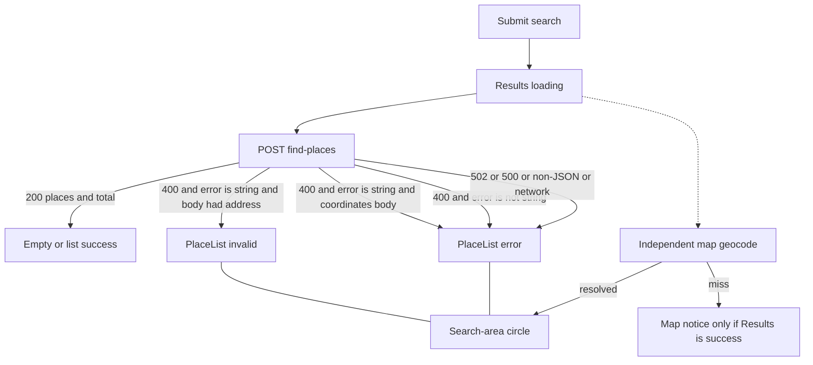

# Places Error Handling - Plan

## Goal Capsule

- **Objective:** Map Places `POST /find-places` error statuses into two Results states: invalid search vs retryable failure, with friendly copy.
- **Product authority:** This plan's Product Contract. Places error mapping in the sibling service is upstream, not this plan's scope.
- **Open blockers:** None.
- **Execution profile:** Extend the find-places client kinds. Thread them through App into PlaceList. Prove classification and copy with Vitest. Smoke one invalid-address and one down-service path in the running app.
- **Stop if:** Places backend edits, Nominatim/display-geocode algorithm changes, a Retry button, or showing Places error text in the UI.
- **Product Contract preservation:** n/a — `ce-plan-bootstrap`. Nearby explorer AE7 (address geocode failure as retryable) is superseded here.

---

## Product Contract

### Summary

Nearby explorer currently treats every Places failure as one “Places is down, try again” message. Places now returns a structured error contract. The UI should tell the explorer when the search itself is unusable, especially a bad address, versus when Places or the network could not complete a valid search. Empty success stays distinct from both.

### Problem Frame

Places `mapFindPlacesError` now returns HTTP 400 for an address it cannot geocode, 502 when Google Places or geocoding is unavailable, and 500 for unknown failures. Validation failures are a separate 400 with a different body shape. The explorer client ignores status and body and collapses everything to one retryable kind. That makes a typo look like a crashed service.

### Key Decisions

- **Two Results failure buckets, not one.** (session-settled: user-approved — chosen over one catch-all failure: invalid search needs different guidance than a down service) Governs R1, R2, R3, R4.
- **Friendly copy, not Places error text.** (session-settled: user-approved — chosen over showing backend strings as-is: explorer copy should be for a person, not Google/Places internals) Governs R5.
- **Keep the independent map address lookup.** (session-settled: user-approved — chosen over joining map geocode to Places errors: Origin for address mode is still Nominatim-only) Governs R7, R8.

### Actors

- A1. Local explorer — the only human user.
- A2. Places service — `POST /find-places` with the structured error contract.

### Requirements

**Failure kinds**

- R1. An address-mode 400 whose `error` is a string is an invalid search, not empty success and not retryable failure. The same 400 on a coordinates body is retryable failure.
- R2. A 502, 500, network failure, or non-JSON error body is retryable failure, not empty success and not invalid search.
- R3. A 400 whose `error` is not a string (including a validation issues array) is retryable failure.
- R4. Zero places on HTTP 200 stays empty success, not either failure.

**Copy and retry**

- R5. Results copy is friendly and owned by the list. Invalid search: “We couldn’t find that address. Check the spelling and try again.” Retryable failure: “Search couldn’t be completed. Try again in a moment.”
- R6. Resubmit is enough. Do not add a Retry control.

**Map**

- R7. Address-mode Origin still comes from the independent map lookup. A list error may still show a search-area circle if that lookup succeeds.
- R8. Do not claim that search results are shown when Results is a failure. Do not change how Origin is resolved.

### Key Flows

- F1. Invalid address search
  - **Trigger:** A1 submits an address-mode body that A2 cannot geocode.
  - **Actors:** A1, A2
  - **Steps:** Loading replaces the previous list. A2 returns 400 with a string `error`. Results show invalid-search copy.
  - **Outcome:** A1 can change the address and submit again. The map may still show a search-area circle if the independent lookup succeeds.
  - **Covered by:** R1, R5, R6, R7

- F2. Service or network failure
  - **Trigger:** A2 is down, Google Places or geocoding is unavailable, or the request never returns JSON.
  - **Actors:** A1, A2
  - **Steps:** Loading replaces the previous list. Results show retryable-failure copy.
  - **Outcome:** A1 can submit again. This is not empty success.
  - **Covered by:** R2, R4, R5, R6

- F3. Empty neighborhood
  - **Trigger:** A2 returns 200 with an empty list.
  - **Actors:** A1, A2
  - **Steps:** Results show empty success.
  - **Outcome:** A1 does not see either failure copy.
  - **Covered by:** R4

### Acceptance Examples

- AE1. Covers R1, R5. Given an address-mode search, when A2 returns 400 with `{ error: "<string>" }`, then Results shows the invalid-search sentence, not empty success and not the retryable sentence.
- AE2. Covers R2, R5. Given a valid submit, when A2 returns 502 with either Places or geocoding unavailable text, then Results shows the retryable sentence once for both.
- AE3. Covers R2, R4. Given a valid submit, when fetch rejects or A2 returns non-JSON, then Results shows the retryable sentence, not empty success.
- AE4. Covers R4. Given A2 returns 200 `{ places: [], total: 0 }`, then Results shows empty success, not either failure.
- AE5. Covers R3. Given A2 returns 400 whose `error` is an array, then Results shows the retryable sentence, not invalid-search copy.
- AE6. Covers R7, R8. Given an address search where A2 fails and the independent map lookup succeeds, then Results is a failure and the search-area circle may still appear. Copy does not say results are still shown.
- AE7. Covers R6. Given either failure, then the list has no Retry control.

### Success Criteria

- A1 can tell a bad address from a down service without reading Places JSON.
- Empty 200 never looks like a failure.
- Address-mode map Origin still does not come from the find-places response.

### Scope Boundaries

**Out of scope**

- Changing Places, including `mapFindPlacesError` or Zod 400 body shape.
- Changing Nominatim/display-geocode resolution or fit-bounds math.
- Distinguishing the two 502 backend messages in the UI.
- A dedicated Retry button.
- Form-level XOR, radius, and geolocation notices already in the search form.

**Deferred to Follow-Up Work**

- Capturing this error-contract mapping as a `docs/solutions/` learning after it lands.

---

## Planning Contract

### Key Technical Decisions

- KTD1. **Classify by HTTP status plus `error` shape, never by error text.** Address-mode 400 + string `error` → `kind: 'invalid'`. Everything else that is not a valid 200 payload → `kind: 'retryable'`. Do not match “google geocoding invalid address” or the 502 strings. Instantiates R1, R2, R3.
- KTD2. **Discriminated client result stays kind-only.** `FindPlacesFailure` gains `'invalid' | 'retryable'`. PlaceList owns copy per R5. App maps `kind` to PlaceList status after the request-generation guard. Instantiates R5.
- KTD3. **PlaceList status splits `'error'` into `'invalid'` and `'error'`.** `'error'` remains retryable failure so existing loading/success paths stay. Instantiates R1, R2, R5.
- KTD4. **Coordinates-mode 400 string is retryable.** Invalid-search is an address-geocode story. If a coordinates body ever gets 400 + string, treat it as retryable so location mode never says “check the address.” Instantiates R1, R2.
- KTD5. **Clear `mapNotice` whenever Results is a failure.** Nominatim may still set Origin later. The current notice claims results are still shown, which is false on Places failure. Do not change `geocodeAddress`. Instantiates R8. (session-settled inheritance: independent map lookup stays; only the contradictory notice is fixed)

### Assumptions

- Places `mapFindPlacesError` and the Zod 400 issues-array body stay as observed in the sibling `places` service. This plan does not wait on a backend change.
- Form validation already blocks XOR and radius, so a Zod 400 in the browser is contract drift, not a user typo.

### High-Level Technical Design

Classification is a gate on the find-places response, then a one-way map into PlaceList. Copy does not travel in the client result.

### Sequencing

1. Types and client classification with client tests.
2. PlaceList statuses and copy with list tests.
3. App kind → status, generation guard, clear map notice on failure.

### Sources and Research

- Sibling contract: `../places/src/places/domain/errors.ts` (`mapFindPlacesError`) and `../places/src/places/adapters/find-places-route.ts` (Zod 400 `{ error: issues }`).
- Current collapse: `src/places/find-places-client.ts`, `src/places/types.ts`, `src/App.tsx`, `src/results/PlaceList.tsx`.
- Prior product: `docs/plans/2026-08-26-001-feat-nearby-explorer-plan.md` R7, R11, R14, AE2, AE3, AE6, AE7. AE7 is superseded by this plan's R1.
- Map isolation: `docs/solutions/runtime-errors/leaflet-circle-getbounds-unmapped-layer.md`. Do not mix Places HTTP failures with fit-bounds work.
- Vocabulary: `CONCEPTS.md` Origin vs Nearby place. Invalid search and retryable failure are status concepts added with this plan.
- External research skipped: the Places contract and the client/PlaceList pattern are local and sufficient.

---

## Implementation Units

### U1. Classify find-places failures

- **Goal:** The client returns `invalid` only for address-mode 400 + string `error`, and `retryable` for every other failure, including empty-looking HTML 500.
- **Requirements:** R1, R2, R3, R4
- **Dependencies:** None
- **Files:** `src/places/types.ts`, `src/places/find-places-client.ts`, `src/places/find-places-client.test.ts`
- **Approach:**
  1. Extend `FindPlacesFailure.kind` to `'retryable' | 'invalid'` (KTD1, KTD2).
  2. On `!response.ok`, parse JSON when possible. Apply KTD1 and KTD4. Keep the 200 success path unchanged, including empty lists.
  3. Fetch reject, HTML/non-JSON, malformed 200, 502, and 500 stay `retryable`.
- **Execution note:** Extend the existing fetch-stub tests first so the new kinds fail before the mapper exists.
- **Patterns to follow:** `jsonResponse` / `htmlResponse` helpers and `vi.unstubAllGlobals` in `src/places/find-places-client.test.ts`.
- **Test scenarios:**
  - Covers AE1. 400 `{ error: "google geocoding invalid address" }` on an address body → `{ ok: false, kind: "invalid" }`. Assert kind, not UI copy.
  - Covers AE5. 400 `{ error: [] }` on an address body → `retryable`.
  - 400 `{ error: "…" }` on a coordinates body → `retryable` (KTD4).
  - Covers AE2. 502 `{ error: "google places service unavailable" }` → `retryable`. A second 502 with geocoding unavailable text is also `retryable`.
  - Covers AE3. Fetch reject and 500 HTML stay `retryable`.
  - Covers AE4. 200 `{ places: [], total: 0 }` stays `{ ok: true }`.
- **Verification:** Client tests name status, body shape, request mode, and expected kind. No Places error string appears in UI assertions.

### U2. Two PlaceList failure states

- **Goal:** Results shows the invalid-search sentence or the retryable sentence, with no Retry control.
- **Requirements:** R5, R6
- **Dependencies:** U1
- **Files:** `src/results/PlaceList.tsx`, `src/results/PlaceList.test.tsx`
- **Approach:**
  1. Add `'invalid'` to `PlaceListStatus`. Keep `'error'` as retryable failure (KTD3).
  2. Reuse `place-list__error` and `aria-live="assertive"` for both branches. Copy is the R5 sentences only.
- **Patterns to follow:** Existing idle/loading/success branches in `src/results/PlaceList.tsx`. Status-driven RTL tests in `src/results/PlaceList.test.tsx`.
- **Test scenarios:**
  - Covers AE1. `status="invalid"` shows the invalid-search sentence and not the retryable sentence.
  - Covers AE2. `status="error"` shows the retryable sentence and not the invalid-search sentence.
  - Covers AE7. Neither failure status renders a Retry button or link.
  - Loading still hides previous rows (existing case must stay green).
- **Verification:** PlaceList tests cover both copies. Class names and layout stay compact like other non-list states.

### U3. Thread kinds through App

- **Goal:** `handleSearch` maps client `kind` onto PlaceList after the generation check, and does not claim results are shown when the list failed.
- **Requirements:** R7, R8
- **Dependencies:** U1, U2
- **Files:** `src/App.tsx`
- **Approach:**
  1. After the generation guard, map `invalid` → `status: 'invalid'`, other failures → `status: 'error'`.
  2. On either failure, clear `mapNotice`. Leave Nominatim `geocodeAddress` and Origin updates as they are (KTD5, R7).
- **Patterns to follow:** Existing `requestGeneration` stale-drop for both `findPlaces` and Nominatim.
- **Test scenarios:**
  - Test expectation: none for a new App test file — there is no `App.test.tsx`. Prove mapping via U1 and U2. Smoke AE6 in the running app: invalid or retryable list plus an optional search-area circle, and no “results are still shown” notice on failure.
- **Verification:** Address search with Places down or invalid still can show a circle. Failure never leaves the success-only map notice visible.

---

## Verification Contract

| Gate | How | Proves |
|---|---|---|
| Client kinds | `npm test` — `src/places/find-places-client.test.ts` | U1, AE1–AE5 |
| List copy | `npm test` — `src/results/PlaceList.test.tsx` | U2, AE1, AE2, AE7 |
| Typecheck | `npm run build` or project typecheck | Status union compiles through App |
| Smoke invalid address | Running app against Places | AE1, AE6 |
| Smoke Places stopped or 502 | Running app | AE2, AE3, AE6 |
| Smoke empty 200 | Search that returns no places | AE4 |

---

## Definition of Done

- U1–U3 are implemented against the cited requirements.
- Client tests lock 400 string vs 400 array vs 502 vs network vs empty 200.
- PlaceList shows the two R5 sentences and no Retry control.
- App does not show the success-only map notice on a failed search.
- Nominatim/display-geocode and Places backend are unchanged.
- Abandoned experimental mapping (text matching, extra kinds, Retry UI) is not left in the tree.
