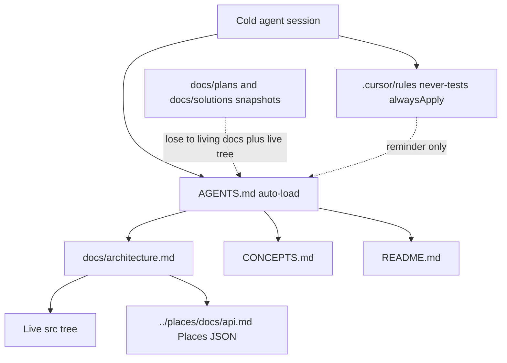
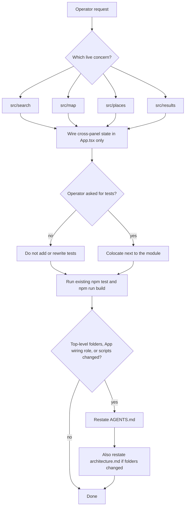

# AI Living Docs Harness - Plan

## Goal Capsule

- **Objective:** Give a cold coding agent a living-docs harness so it can orient in this nearby-explorer, find the live folders, and follow working rules without chat history.
- **Product authority:** This plan's Product Contract. Sibling `../places` is the documentation-ownership pattern, not a layout to paste.
- **Open blockers:** None.
- **Execution profile:** Docs-only. Create and extend living files. Do not change `src/`, scripts, or product behavior. Do not add tests.
- **Stop if:** Hexagonal folders, a Vite proxy, result pins, a local `docs/api.md`, a new `typecheck` script, unsolicited tests, or implementing unshipped invalid-search UI.
- **Product Contract preservation:** Product Contract authored here (`ce-plan-bootstrap`).

---

## Product Contract

### Summary

Add a living-docs AI harness that matches the sibling Places service's documentation jobs: README for identity and how to run, `AGENTS.md` for commands and working rules, `docs/architecture.md` for live layout, `CONCEPTS.md` for glossary, and one thin always-apply Cursor rule for no unsolicited tests. Describe this Vite/React nearby-explorer as it is.

### Problem Frame

A new agent in this repo sees a how-to README, a nearby-search glossary, and snapshot plans. It does not get an architecture map, a feature recipe, or working rules. Cursor auto-loads only root `AGENTS.md` and always-apply rules, and those files do not exist. Agents then copy sibling hexagonal recipes, treat snapshot plans as the live backlog, or add tests to look complete.

The sibling Places service already solved this with a four-file living-docs split plus a thin Cursor reminder. This frontend needs the same jobs, written for colocated feature folders and `App.tsx` wiring.

### Key Decisions

- **Full living-docs set** over an `AGENTS.md`-only file. Governs R1, R2, R9.
- **Copy the sibling never-write-tests-unless-asked rule** over treating tests as unsolicited proof of completeness. (session-settled: user-directed — chosen over keeping tests as unsolicited proof: the operator wants the same test gate as Places) Governs R6, R7.
- **Describe the live SPA** over importing hexagonal slices. Governs R3, R4, R10.
- **Keep CONCEPTS Invalid search with a not-live note** over deleting the term or documenting it as shipped. Governs R8.

### Requirements

**Harness files**

- R1. A cold agent that only auto-loads `AGENTS.md` and always-apply rules can find the live folders, the add-a-feature recipe, Always / Ask / Never, and conflict/precedence without opening plans.
- R2. Living docs follow the sibling ownership split: README is identity and how to run; `AGENTS.md` is commands, architecture map, recipe, and working rules; `docs/architecture.md` is live layout; `CONCEPTS.md` is glossary only.
- R3. The architecture map and recipe name the live tree: `src/search/`, `src/map/`, `src/places/`, `src/results/`, wiring in `src/App.tsx`, colocated `src/**/*.test.ts(x)`.
- R4. Living docs do not teach `domain` / `service` / `adapters`, `buildApp`, `tests/<slice>/`, or `npm run typecheck`.
- R5. README keeps the current run story (sibling Places on port 3000, CORS plugin, direct `fetch`, optional `VITE_PLACES_BASE_URL`) and adds a short Docs index.

**Working rules**

- R6. Do not create, add, expand, or rewrite tests unless the user asked for tests in that request. Run existing `npm test` when claiming done. Existing colocated tests stay.
- R7. Implementing a snapshot plan is not permission to write tests. The living Never-tests rule wins unless this request names tests.
- R8. CONCEPTS keeps Origin, Search area, Nearby place, Invalid search, and Retryable failure. Invalid search is labeled product meaning, not live: `findPlaces` currently returns only `kind: 'retryable'`.
- R9. One always-apply Cursor rule restates Never-tests. `AGENTS.md` remains the source of truth; `.cursor/rules` and chat are not.

**Boundaries named in the harness**

- R10. Ask first before a Vite proxy, result pins or geocoding place rows, hexagonal restructure, new tests, new outbounds besides Places and Nominatim display geocode, a Google Maps JS key, or exposing the app beyond local use.
- R11. Same change restates `AGENTS.md` (and `docs/architecture.md` when folders change) if top-level `src/` folders, `App.tsx` wiring role, or `package.json` scripts change. CSS-only and copy-only edits do not require a restatement.
- R12. `docs/plans/` and `docs/solutions/` are snapshots. Living docs plus the live tree win on layout.

### Actors

- A1. Cold coding agent with no chat history. Auto-loads `AGENTS.md` and always-apply rules only.
- A2. Human operator who runs the app and asks for work.

### Key Flows

- F1. First load
  - **Trigger:** A1 opens this repo in a new session.
  - **Actors:** A1
  - **Steps:** Auto-load `AGENTS.md` and the never-tests rule. Follow Commands, map, recipe, and Never. Open architecture or CONCEPTS only when the map points there.
  - **Outcome:** A1 does not copy sibling hexagonal AGENTS or treat `docs/plans/` as the operating recipe.
  - **Covered by:** R1, R4, R12
- F2. Add a feature
  - **Trigger:** A2 asks for a search, map, client, or results change.
  - **Actors:** A1, A2
  - **Steps:** Pick the matching live folder. Wire cross-panel state only in `src/App.tsx`. Add tests only if A2 asked. Run existing `npm test` and `npm run build`.
  - **Outcome:** The change lands in the live concern, not a new hexagonal slice.
  - **Covered by:** R3, R6, R11
- F3. Snapshot vs living tests
  - **Trigger:** A2 says to follow or implement a plan whose units include tests.
  - **Actors:** A1, A2
  - **Steps:** Change production files as asked. Do not create or rewrite tests unless this request names tests.
  - **Outcome:** Snapshot IUs do not override Never-tests.
  - **Covered by:** R6, R7, R12
- F4. Temptation trap
  - **Trigger:** CORS failure, “show places on the map,” or a glance at `../places`.
  - **Actors:** A1
  - **Steps:** Ask first per R10. Keep origin marker plus radius circle. Keep Nominatim independent of Places. Do not add a proxy or hexagonal folders.
  - **Outcome:** Product behavior and layout stay as-is.
  - **Covered by:** R4, R10

### Acceptance Examples

- AE1. Cold first load
  - **Covers:** F1 / R1, R4
  - **Given:** A1 has only `AGENTS.md` and the always-apply rule.
  - **When:** A1 decides where a new search-form control goes.
  - **Then:** The answer is `src/search/` plus `src/App.tsx` only if state must cross panels. It is not `src/search/{domain,service,adapters}/`.
- AE2. Unsolicited tests
  - **Covers:** F3 / R6, R7
  - **Given:** A2 asks to implement a snapshot plan that lists Vitest files.
  - **When:** A1 does the work.
  - **Then:** A1 does not add or rewrite tests unless A2 said to add tests in that request.
- AE3. Invalid search is not a build ticket
  - **Covers:** R8
  - **Given:** CONCEPTS still defines Invalid search.
  - **When:** A1 reads living docs without being asked to ship error handling.
  - **Then:** A1 does not add `kind: 'invalid'` or two-kind PlaceList copy.
- AE4. No result pins
  - **Covers:** F4 / R10
  - **Given:** The map already has an origin `CircleMarker` and a radius `Circle`.
  - **When:** A2 asks to improve the map without asking for pins.
  - **Then:** A1 does not geocode result rows or add `NearbyPlace` markers.
- AE5. File jobs do not duplicate
  - **Covers:** R2, R5
  - **Given:** The living set is complete.
  - **When:** A2 wants to run the app.
  - **Then:** README still owns CORS and sibling `npm run dev`. The recipe and Never list live in `AGENTS.md`, not README.

### Success Criteria

- A cold agent can name the four feature folders and `App.tsx` as the wiring surface after reading `AGENTS.md` alone.
- Grep of living docs finds no hexagonal recipe, no `npm run typecheck`, and no required “add tests” recipe step.
- `git diff` for `src/`, `package.json`, and Vite config is empty.
- If `npm test` or `npm run build` are run, they still pass as a no-behavior check. They are not required harness proof.

### Scope Boundaries

**In scope**

- Create `AGENTS.md`, `docs/architecture.md`, and `.cursor/rules/no-unsolicited-tests.mdc`.
- Extend `CONCEPTS.md` and README Docs links.
- Document live behavior, including the not-live Invalid search note.

**Out of scope**

- App behavior, CORS proxy, result pins, Places backend edits.
- A frontend `docs/api.md`.
- Rewriting snapshot plans or solution writeups.
- Adding, expanding, or rewriting tests.
- Product chatbot, MCP, or agent tools for search / call / open-in-maps.

**Deferred to Follow-Up Work**

- Capture a `docs/solutions/` learning after this harness lands.
- Restate Invalid search as live after error-handling ships.

### Dependencies

- Sibling Places HTTP field catalog remains `../places/docs/api.md`. Point at it. Do not copy field tables.
- Pattern source: `../places/AGENTS.md`, `../places/docs/architecture.md`, `../places/CONCEPTS.md` Layout entries Living docs and Snapshot, `../places/.cursor/rules/no-unsolicited-tests.mdc`. Copy jobs and section order. Do not copy slice paths.

---

## Planning Contract

### Key Technical Decisions

- KTD1. **AGENTS.md is portable authority; the Cursor rule is a one-line duplicate.** Match sibling section order: Commands, architecture map, Always / Ask first / Never, numbered recipe, Boundaries. The `.mdc` file is `alwaysApply: true` and only restates Never-tests. Governs how R1, R6, R9 are implemented.
- KTD2. **Commands match this `package.json`.** List `npm install`, `npm run dev`, `npm test`, `npm run lint`, `npm run build`. Say typecheck is the `tsc -b` half of `build`. Do not add a `typecheck` script. Governs R4.
- KTD3. **One numbered SPA recipe, four exemplars.** Pick `search` | `map` | `places` | `results`, edit those files, wire cross-panel state only in `src/App.tsx`, tests only if asked and colocated, verify with existing scripts, restate living docs when R11 fires. Point at all four folders plus `App.tsx`. There is no single copy-me feature. Governs R3.
- KTD4. **Conflict/precedence.** Code plus package scripts win for runtime. Among living docs: this file’s Never and numbered recipe win for how to add work, including over snapshot plan IUs (R7); `docs/architecture.md` wins for folder roles; CONCEPTS wins for names; README wins for how to run and CORS; sibling `../places/docs/api.md` wins for Places JSON. `.cursor/rules` and chat are not source of truth. `docs/plans/` and `docs/solutions/` are snapshots. Governs R2, R7, R12.
- KTD5. **Map origin is independent of the Places list.** Coordinates set origin immediately. Address mode sends the string to Places and geocodes Nominatim for the map only. Architecture must say origin `CircleMarker` is allowed; result markers are never; do not geocode place rows. Governs R10, AE4.
- KTD6. **Invalid search stays in CONCEPTS with a not-live sentence.** Live client: `FindPlacesFailure.kind` is only `'retryable'`; PlaceList `'error'` is that bucket. Do not implement plan `docs/plans/2026-08-26-003-feat-places-error-handling-plan.md` in this pass. Governs R8.
- KTD7. **No local HTTP field catalog.** Link sibling `../places/docs/api.md` from architecture. Client mapping lives in `src/places/find-places-client.ts`. Do not paste XOR / `primaryTypes` / status JSON tables into README or architecture. Governs R2, R5.
- KTD8. **Docs-only verification.** Proof is cold-read plus grep plus empty `src/` diff. Existing `npm test` / `npm run lint` / `npm run build` are optional no-behavior checks. They are not the harness acceptance test. Do not add markdown or Vitest files to prove the docs. Governs R6.

### High-Level Technical Design

Living-docs ownership and first-load context:

Add-a-feature protocol:

### Sequencing

Write `docs/architecture.md` from the live tree first. Extend CONCEPTS next so names exist. Write `AGENTS.md` so first-load can link both. Patch README Docs index. Add the Cursor rule last so its Never sentence matches `AGENTS.md`.

---

## Implementation Units

### U1. SPA architecture map

- **Goal:** Add `docs/architecture.md` that describes the live nearby-explorer layout.
- **Requirements:** R2, R3, R4, R10, R12
- **Dependencies:** None
- **Files:** `docs/architecture.md` (create)
- **Approach:**
  1. Slim page matching sibling tone, not ports-and-adapters.
  2. Name `src/main.tsx` as mount-only and `src/App.tsx` as search-state wiring per KTD3.
  3. Map folders: search form and XOR body; Places client, types, catalog; Nominatim display geocode vs Places search; search-area map with origin marker, radius circle, and `boundsForSearchArea`; PlaceList live statuses `idle | loading | success | error`.
  4. Note shared layout CSS in `src/App.css`.
  5. Link `AGENTS.md` for the recipe, `CONCEPTS.md` for names, sibling `../places/docs/api.md` for Places JSON per KTD7.
  6. Label `docs/plans/` and `docs/solutions/` as snapshots.
- **Execution note:** Docs-only. Ground every row in the live `src/` tree before writing.
- **Patterns to follow:** Sibling `../places/docs/architecture.md` slimness and role tables. Live composition in `src/App.tsx`.
- **Test scenarios:**
  - A reader of this file can name the four feature folders and `App.tsx` as the wiring surface.
  - Covers AE4. The map section allows origin `CircleMarker` and forbids `NearbyPlace` markers and geocoding place rows.
  - Grep of this file finds no `buildApp`, `hexagonal`, `tests/<slice>`, or inbound HTTP field tables.
- **Verification:** File exists, matches the live tree, and links rather than restating Places JSON.

### U2. Glossary living-docs terms

- **Goal:** Extend `CONCEPTS.md` with Living docs and Snapshot, and mark Invalid search as not live.
- **Requirements:** R2, R8
- **Dependencies:** None
- **Files:** `CONCEPTS.md` (modify)
- **Approach:**
  1. Keep the file glossary-only.
  2. Add Living docs and Snapshot using sibling meaning, with composition-win replaced by code plus package scripts. Do not add Hexagonal layout or Composition root.
  3. Keep Origin, Search area, Nearby place, Retryable failure.
  4. Add one not-live sentence on Invalid search per KTD6. Do not treat form `SearchRequestError` as Invalid search.
- **Execution note:** Do not implement error-handling code.
- **Patterns to follow:** Existing nearby-search entries. Sibling Layout entries Living docs and Snapshot only.
- **Test scenarios:**
  - Covers AE3. Invalid search remains defined and states that the live client only returns retryable.
  - Living docs / Snapshot exist and do not mention hexagonal layout.
  - Existing Origin wording still says address geocode is for the map only.
- **Verification:** Glossary still reads as names, not a second architecture essay.

### U3. AGENTS.md harness

- **Goal:** Create the auto-load contract a cold agent can follow.
- **Requirements:** R1, R3, R4, R6, R7, R9, R10, R11, R12
- **Dependencies:** U1, U2
- **Files:** `AGENTS.md` (create)
- **Approach:**
  1. Follow KTD1 section order and KTD2 command list.
  2. Architecture map table per R3, plus rows for `CONCEPTS.md`, `docs/plans/` and `docs/solutions/` snapshots, and colocated tests.
  3. Always: extend live folders and wire `App.tsx`; update this file when R11 fires; run existing `npm test` and `npm run build` before claiming done; keep search-area map not result pins; call Places with browser `fetch` and no Vite proxy unless asked.
  4. Ask first per R10, including creating or rewriting tests.
  5. Never: unsolicited tests; hexagonal copy from `../places`; Vite proxy to fix CORS; result pins; inventing place coordinates; treating `.cursor/rules` or chat as truth; treating orphan `node_modules` as the stack; treating snapshot plans as the operating recipe.
  6. Numbered recipe per KTD3. Tests step: only if asked. Verify step: run existing tests; do not add tests to make the step exist.
  7. Boundaries per KTD4. State that implementing a plan is not asking for tests.
- **Execution note:** This file must stand alone on first load. Do not defer no-proxy, no-pins, or no-hexagonal to architecture.md only.
- **Patterns to follow:** Sibling `../places/AGENTS.md` jobs and Always / Ask / Never shape. Live scripts in `package.json`.
- **Test scenarios:**
  - Covers AE1. After this file alone, a new search control goes to `src/search/`, not a hexagonal slice.
  - Covers AE2. Never-tests beats snapshot plan IUs unless the request names tests.
  - Commands list has no `npm run typecheck`.
  - First-load traps (proxy, pins, hexagonal, unsolicited tests, plans-as-recipe) appear in Ask or Never, not only as links.
- **Verification:** Cold-read AE1–AE2 pass. Cross-links to U1 and U2 files resolve.

### U4. README Docs index

- **Goal:** Point operators at the harness without turning README into a second recipe.
- **Requirements:** R2, R5
- **Dependencies:** U1, U2, U3
- **Files:** `README.md` (modify)
- **Approach:**
  1. Keep Nearby explorer identity, sibling run steps, CORS plugin, `VITE_PLACES_BASE_URL`, and Scripts.
  2. Add a short Docs list: `AGENTS.md`, `docs/architecture.md`, `CONCEPTS.md`.
  3. Optional one-line Scripts clarification that `npm test` runs colocated Vitest. Do not paste Never or the feature recipe.
- **Patterns to follow:** Current README. Sibling README Docs block as a link list only.
- **Test scenarios:**
  - Covers AE5. How-to-run and CORS stay in README. Recipe and Never stay in `AGENTS.md`.
  - Docs links resolve to the files from U1–U3.
- **Verification:** README remains the operator runbook.

### U5. Always-apply never-tests rule

- **Goal:** Duplicate Never-tests for sessions that load Cursor rules.
- **Requirements:** R6, R9
- **Dependencies:** U3
- **Files:** `.cursor/rules/no-unsolicited-tests.mdc` (create)
- **Approach:**
  1. Copy sibling frontmatter: `description`, `alwaysApply: true`.
  2. Body matches the AGENTS Never-tests sentence. Do not put the architecture map or Ask-first list in this file.
- **Patterns to follow:** `../places/.cursor/rules/no-unsolicited-tests.mdc`.
- **Test scenarios:**
  - Only one always-apply rule exists, and it does not contain the architecture map.
  - Wording matches U3 Never-tests rather than inventing a second policy.
- **Verification:** Rule is a reminder. `AGENTS.md` still says `.cursor/rules` is not source of truth.

---

## Verification Contract

| Gate | Command or check | Applies | Done signal |
|---|---|---|---|
| Empty product diff | `git diff` on `src/`, `package.json`, Vite config | All units | No production or script changes |
| Cold-read | Read `AGENTS.md` as A1 | U3, then U1 | AE1, AE2, AE4 hold |
| Stale vocabulary | Grep living docs for `hexagonal`, `buildApp`, `tests/<slice>`, `npm run typecheck`, “add tests” as a required recipe step | U1–U3 | No matches except “do not copy hexagonal” if needed in Never |
| Optional regression | `npm test`, `npm run lint`, `npm run build` | After docs land | Existing suite still passes |
| File jobs | README vs AGENTS vs architecture vs CONCEPTS | U4 | Each file owns one job per R2 |

Do not add tests. Do not treat green Vitest as harness proof.

---

## Definition of Done

- U1–U5 landed. Living set exists and cross-links.
- AE1–AE5 hold on a cold read.
- No `src/` or script changes. No new tests. No local `docs/api.md`.
- Invalid search is not documented as live client behavior.
- Abandoned draft files from this pass are removed.

---

## System-Wide Impact

This pass is context parity for coding agents, not action parity for the explorer. Search, geolocation permission, and CORS plugin install stay human-only. Sibling `../places/AGENTS.md` remains the Places-service recipe. Agents working in both repos must not paste that recipe here.

---

## Risks & Dependencies

- Copying sibling hexagonal Commands or slice paths. Mitigation: KTD2, KTD3, U3 Never.
- CONCEPTS Invalid search launching unshipped error handling. Mitigation: KTD6 not-live sentence.
- Snapshot plans whose IUs start with tests. Mitigation: KTD4 and R7 in `AGENTS.md` Boundaries.
- Extra always-apply rules that drift from `AGENTS.md`. Mitigation: U5 is one thin file.
- Documenting intended architecture instead of the live tree. Mitigation: U1 is written from `src/` as it exists.

---

## Sources & Research

- Pattern source: `../places/AGENTS.md`, `../places/docs/architecture.md`, `../places/CONCEPTS.md`, `../places/.cursor/rules/no-unsolicited-tests.mdc`.
- Ownership and snapshot rule: `../places/docs/solutions/documentation-gaps/living-docs-hexagonal-slices.md` (copy jobs, not hexagonal content).
- Docs-only verification: `../places/docs/solutions/documentation-gaps/restate-logger-living-docs-when-code-diverges.md`.
- No second HTTP catalog: `../places/docs/solutions/documentation-gaps/live-http-fields-owned-by-docs-api.md`.
- Live SPA composition: `src/App.tsx`, `src/places/find-places-client.ts`, `src/map/SearchAreaMap.tsx`.
- Unshipped error-handling snapshot: `docs/plans/2026-08-26-003-feat-places-error-handling-plan.md`.
