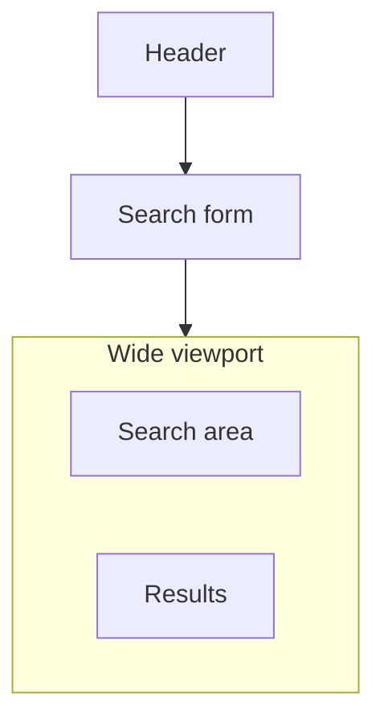
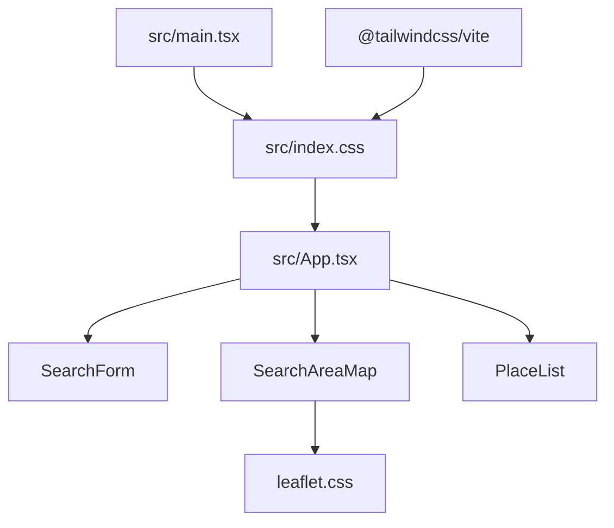

# Tailwind CSS Restack - Plan

## Goal Capsule

- **Objective:** Restack this nearby-explorer’s chrome onto Tailwind v4 utilities on the markup, keeping current colors, layout, and states, while spacing, radii, and the stack breakpoint follow Tailwind’s default scale.
- **Product authority:** This plan’s Product Contract. The portfolio at https://github.com/adj2424/portfolio is the class-writing habit, not the look or the toolchain.
- **Open blockers:** None.
- **Execution profile:** Smoke-first. Existing `npm test` and `npm run build` stay green. No new tests. Browser-prove light/dark, stacked vs side-by-side, and map tiles.
- **Stop if:** Search/Places/geocode behavior changes; result pins; Vite proxy; new outbounds; rewriting snapshot plans; adding tests; restyling toward the portfolio look; changing `server.port` / `strictPort`.
- **Product Contract preservation:** restructured, no scope change: R4 and AE6 now name the live invalid list treatment and map-miss notice already implied by R9.

---

## Product Contract

### Summary

This app will use Tailwind v4 as its styling system.
Utilities live on the markup; BEM stylesheets are not the styling system.
Colors, two-column layout, and states stay recognizable as this nearby-explorer, including system light and dark.
Spacing, radii, and the stack breakpoint follow Tailwind’s default scale.

### Problem Frame

The explorer is styled with two global CSS files and BEM class names.
The author’s portfolio is styled with Tailwind utilities on the markup.
Keeping both conventions means every visual change is written two different ways.
The cost of doing nothing is that this app stays the CSS-file outlier, not that search stops working.

### Key Decisions

- **Keep this explorer’s colors and layout, not the portfolio look.** (session-settled: user-directed — chosen over restyling toward the portfolio: Tailwind is the writing system, not a new visual identity) Governs R1, R2, R4
- **Tailwind v4.** (session-settled: user-directed — chosen over cloning the portfolio’s 3.4 toolchain: the request was newest Tailwind) Governs R5
- **Utilities on the markup; BEM is not the styling system.** (session-settled: user-directed — chosen over keeping BEM class names or implementing BEM with Tailwind: same habit as the portfolio) Governs R5, R6, R8
- **Default Tailwind rhythm.** (session-settled: user-directed — chosen over a rem-for-rem copy and over Tailwind-only-on-new-UI: small visual drift is accepted so one scale is the spacing language) Governs R3
- **System light and dark stay part of the color story.** (session-settled: user-approved — chosen over dropping dark: “same colors” includes the existing pair) Governs R1
- **Map library tiles and controls stay as shipped.** Governs R7
- **Search behavior is unchanged; this is a chrome restack.** Governs R9

### Actors

- A1. Explorer — uses the nearby search UI in the browser.
- A2. Author — changes visual chrome after this ships.

### Requirements

**Look**

- R1. Light and dark palettes stay this explorer’s current colors (text, heading, muted, background, surface, border, accent, accent-hover, danger), not the portfolio’s orange / near-black / ghost-white set. Dark follows the system preference.
- R2. Composition stays: header, then search form, then search-area and results side by side on wide viewports and stacked on narrow ones.
- R3. Spacing, corner radii, and the narrow-stack breakpoint use Tailwind’s default scale. Exact current rem values and the 800px stack point are not a lock.
- R4. Disabled fields, locating submit, submit hover and disabled, danger form notices, map-miss surface notice, and idle / loading / success / invalid / error list treatments stay recognizable.

**Writing system**

- R5. The styling system is Tailwind v4.
- R6. Visual chrome is expressed as utilities on elements, in the same habit as the portfolio.
- R7. The map library’s own tiles and controls stay as that library ships.
Search-area chrome around the map is restacked with the rest of the app.
- R8. Living docs describe styling as Tailwind utilities on markup, not as a shared BEM layout stylesheet.

**Behavior**

- R9. Origin search, Places calls, map origin and radius, and the results list states do not change.

### Key Flows

- F1. Wide chrome
  - **Trigger:** A1 opens the app on a wide viewport.
  - **Actors:** A1
  - **Steps:** Read header and form. See search-area and results beside each other.
  - **Outcome:** Per R2 and R3.
  - **Covered by:** R2, R3

- F2. Narrow chrome
  - **Trigger:** A1 opens the app on a narrow viewport.
  - **Actors:** A1
  - **Steps:** Read header and form. See search-area and results stacked.
  - **Outcome:** Per R2 and R3.
  - **Covered by:** R2, R3

- F3. System dark
  - **Trigger:** A1’s system prefers dark.
  - **Actors:** A1
  - **Steps:** Load the app.
  - **Outcome:** Per R1.
  - **Covered by:** R1

### Acceptance Examples

- AE1. Covers R1. Given the restacked app, When A1 compares it to the portfolio, Then accent, type, and page black/white are this explorer’s, not the portfolio’s.
- AE2. Covers R2, F1. Given a wide viewport, When the app is showing, Then the search-area and results sit side by side under the form.
- AE3. Covers R2, R3, F2. Given a narrow viewport, When the app is showing, Then the search-area and results stack, and the stack point is a Tailwind default breakpoint.
- AE4. Covers R1, F3. Given `prefers-color-scheme: dark`, When the app loads, Then surfaces, text, and accent use this explorer’s dark palette.
- AE5. Covers R5, R6. Given markup after the restack, When A2 styles chrome, Then they add utilities on elements rather than BEM classes backed by a layout stylesheet.
- AE6. Covers R9. Given a search, When Places returns, Then the list still shows idle / loading / success (including empty) / invalid / error as today, with the same copy.
- AE7. Covers R7. Given a search that shows the map, When A1 looks at tiles and map controls, Then they still look like the map library’s shipped chrome.

### Success Criteria

- A1 still treats the screen as this nearby-explorer, not as the portfolio.
- A2’s next visual tweak is a utility change, not a BEM stylesheet edit.

### Scope Boundaries

- In: restack existing chrome to Tailwind v4 per R1–R9.
- Out: portfolio restyle; keeping BEM as the styling system; Tailwind only on new UI while leaving the old CSS; changing search, geocode, Places, or map behavior; result pins; new outbounds.

**Deferred for later**

- Matching the portfolio look (orange, Inter, fluid type).
- Sharing one token set across this app and the portfolio.

**Deferred to Follow-Up Work**

- Restating the stale Results status list in `docs/architecture.md` / `AGENTS.md` Ask-first `invalid` line. Live `PlaceList` already has invalid; this plan only changes the styling-system sentences.

### Dependencies / Assumptions

- Assumed: no Tailwind is in this app today (verified against `package.json` and `src/`).
- Assumed: existing tests do not lock BEM class names, so a className restack is not a test-contract change.
- Newest Tailwind means the v4 line current when this is implemented, not a frozen patch.

### Sources

- Class-writing reference: https://github.com/adj2424/portfolio (Tailwind 3.4, utilities on JSX, tokens in JS config). Use the habit, not the version or the look.
- Color and layout source: `src/index.css` (tokens, `prefers-color-scheme`) and `src/App.css` (BEM layout, 800px stack, 28rem / 18rem panel heights).
- Living-doc styling role today: `AGENTS.md` and `docs/architecture.md` name shared panel layout as `src/App.css`.
- Results-state convention: `docs/solutions/conventions/find-places-invalid-vs-retryable-mapping.md`.
- Map fit: `docs/solutions/runtime-errors/leaflet-circle-getbounds-unmapped-layer.md`.
- Vite ports: `docs/solutions/tooling-decisions/vite-default-port-3000-places-on-3001.md`.

---

## Planning Contract

### Key Technical Decisions

- KTD1. **Install Tailwind v4 via the Vite plugin, not PostCSS.** Instantiates R5. (session-settled: user-directed — chosen over cloning the portfolio’s 3.4 PostCSS toolchain: newest Tailwind on this Vite 8 app) Packages: `tailwindcss` and `@tailwindcss/vite` (v4.2.2+ so Vite 8 is a peer). CSS entry: `@import "tailwindcss"` in `src/index.css`. No `tailwind.config.js`, no `@tailwind` directives, no new PostCSS config.
- KTD2. **Register explorer colors as `--color-*` in `@theme`; override the same variables for dark in `@layer theme` with `@variant dark`.** Instantiates R1. Do not add `@custom-variant dark`. Do not put semantic colors in the `--text-*` font-size namespace. Sparse `dark:` on JSX. Keep `color-scheme: light dark`.
- KTD3. **Mobile-first stack; two equal columns from `md` up; shell `max-w-6xl`.** Instantiates R2, R3. (session-settled: user-approved — chosen over `lg` and over keeping the 1.1fr / 0.9fr split: nearest default below 800px, accepted column-share drift)
- KTD4. **Map canvas and lazy fallback use `h-96` wide and `h-72` stacked.** Instantiates R3, R7. (session-settled: user-approved — chosen over keeping 28rem / 18rem arbitrary heights: default scale; Leaflet still needs an explicit height)
- KTD5. **Keep `leaflet/dist/leaflet.css` on the lazy map module.** Instantiates R7. If Preflight distorts tiles or controls, add the minimum scoped undo under the map container. Do not restyle `.leaflet-*` as app chrome. Do not call `getBounds` on an unmapped Circle; fit stays `boundsForSearchArea`.
- KTD6. **No `@apply` for app chrome. Origin legend uses `sr-only`.** Instantiates R6. Drop `.visually-hidden`.
- KTD7. **Origin marker and radius `pathOptions` hex stay as they are.** Instantiates R7, R9. Do not follow dark `--accent` on overlays.
- KTD8. **Do not add, expand, or rewrite tests.** Instantiates repo Never. Existing `npm test` must stay green. Visual proof is browser smoke.
- KTD9. **Leave `server.port: 3000` and `server.strictPort: true` unchanged when adding the Tailwind plugin.**

### High-Level Technical Design

Theme tokens and Preflight live in the global CSS entry. Panel chrome is utilities on JSX. Leaflet CSS stays on the lazy map chunk. `src/App.css` is removed after U2.

### Implementation Constraints

- Do not add a Vite proxy.
- Do not change Places client URL or search hops.
- Do not add result pins or geocode place rows.
- Do not rewrite snapshot `docs/plans/` except this file.
- Install from committed manifests after the lockfile update in U1.
- Product Contract preservation: R4 / AE6 clarification only.

### Risks & Dependencies

- **Preflight vs Leaflet.** Global border/image resets can break tiles and zoom chrome. Mitigation: KTD5 — keep the lazy Leaflet import; add a scoped undo only if smoke fails; do not disable Preflight app-wide.
- **Map without height.** Leaflet collapses if the canvas has no explicit height. Mitigation: KTD4 on both the canvas and the Suspense fallback.
- **U1 without U2.** Enabling Tailwind Preflight while `src/App.css` still owns BEM makes the UI look wrong. Mitigation: land U1 and U2 in the same working session; U1 is not shippable alone.
- **Vite port.** Adding the plugin can clobber `server` if the file is rewritten carelessly. Mitigation: KTD9.
- **Fit crash.** Restacking map class names must not reintroduce `Circle.getBounds()` on an unmapped layer. Mitigation: KTD5; read `docs/solutions/runtime-errors/leaflet-circle-getbounds-unmapped-layer.md`.

### Assumptions

- `@theme` + `@layer theme` `@variant dark` is the supported way to swap semantic `--color-*` under the default media dark strategy. If a later Tailwind patch forbids that, keep system-preference token swap without a `.dark` class.
- Complete class names in TSX are enough for class detection; no `@source` needed.

### Sources & Research

- Official: https://tailwindcss.com/docs/installation/using-vite, https://tailwindcss.com/docs/dark-mode, https://tailwindcss.com/docs/theme, https://tailwindcss.com/docs/preflight, https://tailwindcss.com/docs/display (sr-only), https://tailwindcss.com/docs/responsive-design
- `@tailwindcss/vite` 4.3.3 peer includes Vite 8; support from 4.2.2.
- Local: `src/index.css` tokens; `src/App.css` BEM; `src/map/SearchAreaMap.tsx` Leaflet import; `vite.config.ts` plugins + port 3000.

---

## Implementation Units

### U1. Tailwind v4 toolchain and theme tokens

- **Goal:** Vite emits Tailwind v4. Explorer hex tokens exist as theme colors, including system dark.
- **Requirements:** R1, R5. KTD1, KTD2, KTD9.
- **Dependencies:** None
- **Files:** `package.json`, `package-lock.json`, `vite.config.ts`, `src/index.css`
- **Approach:**
  1. Add `tailwindcss` and `@tailwindcss/vite` as devDependencies (current v4 line).
  2. Register `tailwindcss()` beside existing React and compiler plugins. Do not touch `server` or `test`.
  3. In `src/index.css`, `@import "tailwindcss"`, then `@theme` for `--font-sans`, `--color-fg` / heading / muted / bg / surface / border / accent / accent-hover / danger, and `--shadow-panel` from today’s hex and shadow. Dark overrides per KTD2.
  4. Keep document defaults that Preflight would drop only if U2 has not yet moved them onto elements (`html`/`body` font, `color-scheme`). Leave `.visually-hidden` until U2.
  5. Leave `src/App.css` imported until U2 so BEM still exists for one commit if needed; expect Preflight to fight BEM until U2 lands.
- **Patterns to follow:** `vite.config.ts` current `defineConfig`. Token hex list in `src/index.css`.
- **Test scenarios:** Test expectation: none -- toolchain and theme. Proof is `npm run build`.
- **Verification:** Build succeeds. `vite.config.ts` still has port 3000 and `strictPort`. No PostCSS config file added.
- **Execution note:** Do not ship U1 without U2. Preflight plus leftover BEM is not the intended look.

### U2. Utilities on markup; remove BEM sheet

- **Goal:** Form, shell, results, and search-area chrome are utilities. BEM classes and `src/App.css` are gone. Map tiles still look like Leaflet.
- **Requirements:** R2, R3, R4, R6, R7, R9. Covers AE1–AE7. KTD3, KTD4, KTD5, KTD6, KTD7, KTD8.
- **Dependencies:** U1
- **Files:** `src/App.tsx`, `src/search/SearchForm.tsx`, `src/results/PlaceList.tsx`, `src/map/SearchAreaMap.tsx`, `src/index.css`, `src/App.css` (delete)
- **Approach:**
  1. Put utilities on shell, map-miss notice, form (including disabled location field, locating submit, type grid, `sr-only` origin legend), list statuses (idle, loading, success empty/non-empty, invalid, error), place cards, and map wrapper/canvas. Include the map Suspense fallback.
  2. Layout per KTD3 and KTD4. Radii from the default scale (`rounded-lg` / `rounded-xl` for 8px / 12px-class chrome).
  3. Keep `import 'leaflet/dist/leaflet.css'` in `SearchAreaMap.tsx`. Do not change `FitToCircle` / `boundsForSearchArea` or overlay `pathOptions`.
  4. If smoke shows broken tiles or controls, add the minimum scoped Preflight undo per KTD5.
  5. Invalid and error list copy stay distinct; they may share danger color utilities. Map-miss notice stays surface+border, not danger.
  6. Remove `import './App.css'` and delete `src/App.css` only after no BEM layout class remains. Remove `.visually-hidden` from `src/index.css`.
  7. Do not edit `src/places/*`, search-request, or display-geocode.
- **Patterns to follow:** Current markup structure in `SearchForm`, `PlaceList`, `App`, `SearchAreaMap`. Portfolio habit of utilities on JSX, not its look.
- **Test scenarios:** Test expectation: none -- styling. Existing PlaceList and SearchForm tests must still pass on roles and copy (Covers AE6). Do not add className assertions.
- **Verification:** `npm test` green. No remaining BEM layout classes. Map canvas has an explicit default-scale height. Browser smoke per Verification Contract.
- **Execution note:** Browser-prove light, dark (`prefers-color-scheme`), narrow vs `md` and up, disabled/locating form, invalid vs retryable copy, map-miss notice, tiles/zoom/attribution, and search-area fit after origin is set.

### U3. Living docs styling role

- **Goal:** Living docs describe Tailwind utilities on markup, not `src/App.css` as the shared BEM layout sheet.
- **Requirements:** R8. KTD8.
- **Dependencies:** U2
- **Files:** `AGENTS.md`, `docs/architecture.md`
- **Approach:**
  1. Replace the architecture-map row and recipe step that name shared panel CSS as `src/App.css`.
  2. In `docs/architecture.md`, replace the sentence that `src/App.css` holds shared form and panel layout.
  3. Do not rewrite the stale Results status / Ask-first `invalid` lines in this unit (deferred follow-up).
  4. Do not edit snapshot plans or `CONCEPTS.md` unless a new glossary term was coined (none expected).
- **Patterns to follow:** `AGENTS.md` Always restatement rule. `CONCEPTS.md` living docs vs snapshot.
- **Test scenarios:** Test expectation: none -- documentation.
- **Verification:** Living docs no longer tell agents to put panel layout in `src/App.css`.

---

## Verification Contract

- `npm test` — existing role/copy contracts stay green (AE6).
- `npm run build` — `tsc -b` plus Vite with `@tailwindcss/vite`.
- `npm run lint` — no new issues from class strings.
- Browser smoke (proves AE1–AE5, AE7, F1–F3): light and dark; stacked below `md` and two equal columns from `md` up; form disabled/locating/danger notice; map-miss surface notice; list idle/loading/success/invalid/error; map tiles, zoom, attribution, origin+radius still painting.

## Definition of Done

- Tailwind v4 is wired through the Vite plugin. Explorer tokens including system dark are the color source.
- BEM layout stylesheet is gone. Chrome is utilities on the form, shell, list, and search-area wrapper.
- Leaflet CSS still loads from the map module. Tiles and controls still look like Leaflet. Fit helper unchanged.
- Living docs name utilities on markup as the styling system.
- Existing tests and build pass. No new tests. No proxy, port, or search-behavior change. Abandoned experimental CSS/config is not left in the diff.
