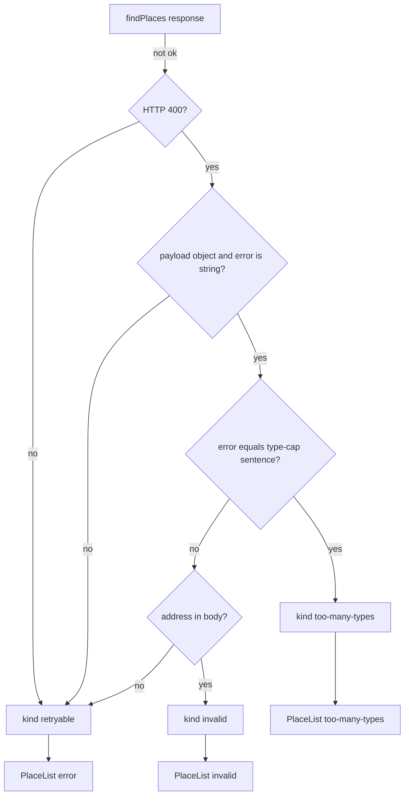

# Too Many Types Error - Plan

## Goal Capsule

- **Objective:** Map Places’ type-cap 400 into a third Results outcome that tells the explorer to deselect categories, in both address and coordinates mode.
- **Product authority:** This plan’s Product Contract. Live Places mapper in the sibling service is upstream; this app does not change Places or its HTTP reference.
- **Open blockers:** None.
- **Execution profile:** Extend find-places kinds. Thread a new PlaceList status through App. Restate living glossary, architecture, and the error-mapping convention. Existing `npm test` and `npm run build`. Browser-smoke type-cap vs address-invalid vs retryable.
- **Stop if:** Places backend edits, copying category expansion into this app, form-side checkbox caps, a Retry button, result pins, a Vite proxy, or adding tests unless the implementation request names tests.
- **Product Contract preservation:** n/a — `ce-plan-bootstrap`. Do not rewrite `docs/plans/2026-08-26-003-feat-places-error-handling-plan.md`.

---

## Product Contract

### Summary

Places now returns a caller-input 400 when selected category keys expand past Google’s 50 included-primary-types cap. Today that 400 looks like a bad address in address mode and a down service in coordinates mode. Results must tell the explorer to deselect some categories. This app’s glossary, architecture, and error-mapping note must match. Sibling Places HTTP docs stay Places-owned.

### Problem Frame

`failureKind` treats every address-mode 400 with a string `error` as invalid search, and every coordinates-mode 400 string as retryable. Type-cap uses that same HTTP shape. Checking several of the 19 category keys is enough to overflow after Places expands keys. The form cannot know the expanded count without copying Places’ category map, which this work will not do.

### Key Decisions

- **Handle after submit in Results, not in the form.** (session-settled: user-approved — chosen over copying expansion sizes to block checkboxes: the 50 cap is on expanded Google types, not checkbox count) Governs R1, R6, R7.
- **Front-only documentation.** (session-settled: user-approved — chosen over editing sibling `../places/docs/api.md`: that file is Places-owned; this app links to it) Governs R9.
- **New plan snapshot.** (session-settled: user-directed — chosen over updating 003 in place: 003 is shipped two-bucket mapping) Governs sequencing only.

### Actors

- A1. Local explorer — the only human user.
- A2. Places service — `POST /find-places` with type-cap 400 and the existing invalid-address / unavailable / Zod envelopes.

### Requirements

**Failure kinds**

- R1. HTTP 400 whose `error` is exactly the Places type-cap sentence is too-many-types, in both address and coordinates mode. Not invalid search, not retryable failure, not empty success.
- R2. Address-mode 400 whose `error` is a different string stays invalid search (address copy).
- R3. Coordinates-mode 400 whose `error` is a different string, Zod-array 400, 502, 500, network failure, and non-JSON bodies stay retryable failure.
- R4. Zero places on HTTP 200 stays empty success.

**Copy and retry**

- R5. PlaceList owns friendly copy. Too-many-types: tell A1 to deselect some categories and search again. Do not show Places payload text. Do not use address-invalid or retryable sentences.
- R6. Resubmit is enough. Do not add a Retry control. Do not auto-uncheck categories.

**Form and map**

- R7. Do not copy Places’ category expansion table. Do not cap checkboxes by a guessed count. Omit-empty `primaryTypes` stays unfiltered search.
- R8. Origin still comes from coordinates on the body or Nominatim. A list error may still show a search-area circle. Clear the map-miss notice on any Places failure. Do not claim results are shown when Results is a failure.

**Docs**

- R9. Living glossary names too-many-types as distinct from invalid search and retryable failure. Architecture restates live Results statuses and client kinds. The error-mapping convention records the one allowed string match. Do not paste Places JSON field tables into README or architecture.

### Key Flows

- F1. Address search, type-cap
  - **Trigger:** A1 submits an address-mode body whose categories expand past the cap.
  - **Actors:** A1, A2
  - **Steps:** Loading replaces the previous list. A2 returns 400 with the type-cap sentence. Results show too-many-types copy.
  - **Outcome:** A1 unchecks some categories and submits again. Address-invalid copy is not shown. The map may still show a circle if Nominatim succeeded.
  - **Covered by:** R1, R5, R6, R8

- F2. Coordinates search, type-cap
  - **Trigger:** A1 submits a coordinates-mode body whose categories expand past the cap.
  - **Actors:** A1, A2
  - **Steps:** Loading, then too-many-types copy. Retryable copy is not shown.
  - **Outcome:** A1 unchecks some categories and submits again. Retryable copy is not shown. Map-miss notice is absent. A search-area circle may still appear from body origin.
  - **Covered by:** R1, R5, R6, R8

- F3. Address still unusable
  - **Trigger:** A2 returns 400 with a string `error` that is not the type-cap sentence.
  - **Actors:** A1, A2
  - **Steps:** Results show invalid-search address copy.
  - **Outcome:** Type-cap copy is not shown.
  - **Covered by:** R2, R5

- F4. Service or network failure
  - **Trigger:** 502, 500 HTML, network, or 400 whose `error` is not a string.
  - **Actors:** A1, A2
  - **Steps:** Results show retryable copy.
  - **Outcome:** Not empty success and not type-cap.
  - **Covered by:** R3, R5

### Acceptance Examples

- AE1. Covers R1, R5. Given address mode, when A2 returns 400 `{ error: "google too many types included in primary types" }`, then Results shows too-many-types copy, not address-invalid and not retryable.
- AE2. Covers R1, R5. Given coordinates mode, when A2 returns the same type-cap 400, then Results shows too-many-types copy, not retryable.
- AE3. Covers R2. Given address mode, when A2 returns 400 `{ error: "google geocoding invalid address" }`, then Results shows address-invalid copy.
- AE4. Covers R3. Given coordinates mode, when A2 returns 400 `{ error: "google geocoding invalid address" }`, then Results shows retryable copy.
- AE5. Covers R3. Given 500 HTML or `fetch` throw, then Results shows retryable copy.
- AE6. Covers R4. Given HTTP 200 with empty `places`, then Results shows empty success.
- AE7. Covers R6, R8. Given type-cap Results, then there is no Retry control, map-miss notice is absent, and a search-area circle may still appear.

### Scope Boundaries

**In scope:** Client kind mapping, PlaceList status and copy, App wiring, CONCEPTS, `docs/architecture.md`, `docs/solutions/conventions/find-places-invalid-vs-retryable-mapping.md`, and the AGENTS Ask-first error-handling line if it still claims invalid is unshipped.

**Out of scope:** Places code and `../places/docs/api.md`. Form-side expansion tables or checkbox caps. Retry button. Result pins. Vite proxy.

**Deferred to follow-up:** Under-legend helper that omit means every category. Highlighting which boxes to uncheck. Numeric remaining-type budget.

---

## Planning Contract

### Assumptions

- Live Places type-cap body is `{ error: "google too many types included in primary types" }` from `TooManyPrimaryTypesError` (`../places/src/places/domain/errors.ts`). Sibling `docs/api.md` may still omit this row. This client matches the live mapper string, not the stale api.md table.
- Selecting several of the 19 catalog keys can exceed 50 expanded types. All-checked is not the same as omit-all (unfiltered).

### Key Technical Decisions

- KTD1. **Third client kind and PlaceList status.** Add `'too-many-types'` (or equivalent) on `FindPlacesFailure.kind` and `PlaceListStatus`. Do not overload `'invalid'` (address copy) or `'error'` (retryable). Instantiates R1, R5.
- KTD2. **Narrow exact-string match after status/shape gates, before address vs coordinates.** If HTTP 400, payload is an object, and `error` equals the live type-cap sentence, return the new kind for both modes. Do not substring, trim, or case-fold. Other address-mode 400 strings stay `'invalid'`. Other coordinates 400 strings stay `'retryable'`. Instantiates R1, R2, R3. This is a named exception to 003 KTD1 / the current convention title, not a general error-text classifier.
- KTD3. **Kind-only client; PlaceList owns copy.** Do not pass Places `error` into the UI. Too-many-types sentence: “Too many categories selected. Deselect some and search again.” Instantiates R5.
- KTD4. **App maps three failure kinds after the generation guard.** New kind → new status. `'invalid'` → `'invalid'`. Everything else that is not ok → `'error'`. Still clear list, `placesOk = false`, and `mapNotice`. Instantiates R1, R8.
- KTD5. **Docs follow living-doc ownership.** CONCEPTS gets **Too many types**. Architecture restates live statuses and kinds. The convention file is updated in this change because it is the error-mapping reference agents will follow. Do not duplicate Places field catalogs. Instantiates R9.

### High-Level Technical Design

Failure classification is a gate chain. Type-cap is inserted after “400 object with string error” and before the address-mode invalid rule.

App remains the only cross-panel mapper. Nominatim does not read `kind`.

### Risks and Dependencies

- **Places wording drift.** If the mapper string changes, type-cap falls through to invalid (address) or retryable (coordinates). Mitigation: exact match on the live sentence; document it in the convention; do not invent aliases.
- **Sibling api.md lag.** Implementers must not copy documented `"invalid address"` as the only 400 string. Live geocode string is `'google geocoding invalid address'`.
- **AGENTS.md Never tests.** Feature-bearing units list scenarios for when tests are asked. Implementing this plan is not permission to add tests. Existing client tests that use the geocoding string stay valid if type-cap is a separate branch.

---

## Implementation Units

### U1. Classify type-cap in the find-places client

- **Goal:** `findPlaces` returns the new kind for the type-cap sentence in both modes, and keeps existing invalid vs retryable rules for every other miss.
- **Requirements:** R1, R2, R3
- **Dependencies:** None
- **Files:** `src/places/types.ts`, `src/places/find-places-client.ts`. Existing `src/places/find-places-client.test.ts` only if the implementation request names tests.
- **Approach:**
  1. Extend `FindPlacesFailure.kind` (KTD1).
  2. In `failureKind`, after 400 + object + string `error`, equality-check the live type-cap sentence (KTD2). Return the new kind without consulting request mode.
  3. Keep the address-mode `'invalid'` path for other strings. Keep coordinates other-string 400 as `'retryable'`.
- **Execution note:** AGENTS.md forbids adding or rewriting tests unless this request names them. If tests are named, cover AE1–AE5 at the client kind layer, not UI copy.
- **Patterns to follow:** `failureKind` in `src/places/find-places-client.ts`. Kind-only return in `findPlaces`.
- **Test scenarios:**
  - Covers AE1. Address body, 400 type-cap sentence → new kind.
  - Covers AE2. Coordinates body, 400 type-cap sentence → new kind.
  - Covers AE3. Address body, 400 geocoding invalid-address string → `'invalid'`.
  - Covers AE4. Coordinates body, 400 geocoding invalid-address string → `'retryable'`.
  - Covers AE5. 500 HTML or thrown `fetch` → `'retryable'`.
  - Zod-array 400 or non-string `error` → `'retryable'` in both modes.
  - Near-miss type-cap string that is still a string → `'invalid'` in address mode and `'retryable'` in coordinates mode.
- **Verification:** Type-cap cannot be mistaken for address-invalid or retryable at the client. Other 400 strings are unchanged.

### U2. Results copy and App wiring

- **Goal:** Results shows too-many-types copy in both modes, with no Retry control, and map-miss notice stays off on Places failure.
- **Requirements:** R5, R6, R8
- **Dependencies:** U1
- **Files:** `src/results/PlaceList.tsx`, `src/App.tsx`. Existing `src/results/PlaceList.test.tsx` only if the implementation request names tests.
- **Approach:**
  1. Add the matching `PlaceListStatus`. Render KTD3 copy with the same danger / `aria-live="assertive"` chrome as invalid and error.
  2. After the generation guard, map the new kind to the new status (KTD4). Do not let it fall through to `'error'`.
  3. Keep clearing places, total, `placesOk`, and `mapNotice` on every Places miss.
- **Execution note:** Same AGENTS.md test rule as U1. Browser-prove AE1, AE2, AE3, AE5, AE7 if Places is running.
- **Patterns to follow:** Invalid and error branches in `src/results/PlaceList.tsx`. Failure block in `src/App.tsx`.
- **Test scenarios:**
  - Covers AE1. New status shows too-many-types sentence and not address-invalid or retryable.
  - Covers AE2. New status shows too-many-types sentence in coordinates mode and not retryable copy.
  - Covers AE7. No Retry button or Retry link on the new status.
  - Existing invalid and error copy stay exclusive of each other and of the new sentence.
- **Verification:** Address type-cap does not show address copy. Coordinates type-cap does not show retryable copy. Map-miss notice is absent on failure.

### U3. Living docs and error-mapping convention

- **Goal:** Glossary, architecture, harness Ask-first, and the mapping convention describe three failure outcomes and the one allowed string match.
- **Requirements:** R9
- **Dependencies:** U1, U2 (status and kind names must be the live ones)
- **Files:** `CONCEPTS.md`, `docs/architecture.md`, `AGENTS.md` (Ask-first error-handling bullet only), `docs/solutions/conventions/find-places-invalid-vs-retryable-mapping.md`
- **Approach:**
  1. Add **Too many types**. Keep **Invalid search** as unusable address. Keep **Retryable failure** as wait-and-resubmit.
  2. Restate Results statuses and `FindPlacesFailure.kind` from the live tree, including `'invalid'` which architecture still omits.
  3. Replace “never classify by error text” with: status/shape/mode gates first; then one exact equality on the type-cap sentence; still never render Places text; still never treat HTML 500 as type-cap.
  4. Ask-first: this named error handling is in scope when requested; do not claim `'invalid'` is unshipped.
- **Patterns to follow:** Existing CONCEPTS entries. Architecture “Places call” and folder-role rows. Convention table of situation → kind → PlaceList status → copy.
- **Test scenarios:** Test expectation: none -- documentation.
- **Verification:** An agent reading living docs plus the convention would not map type-cap to address copy. Sibling api.md is still the Places field link, not a copied table.

---

## Verification Contract

| Gate | How | Covers |
| --- | --- | --- |
| Existing unit suite | `npm test` | Prior invalid/retryable/empty contracts stay green |
| Typecheck + production build | `npm run build` | New kind/status compile through App and PlaceList |
| Browser smoke | Running app against Places | AE1 and AE2 with a fat category set; AE3 gibberish address; AE5 Places down or network; AE7 no Retry and no map-miss-on-failure |

Do not add tests to create a gate. Lint is optional (`npm run lint`).

---

## Definition of Done

- Address-mode and coordinates-mode type-cap 400 show too-many-types copy.
- Address-mode non-type-cap 400 string still shows address-invalid copy.
- Retryable paths (500 HTML, 502, network, array `error`) still show retryable copy.
- Empty 200 is still empty success.
- No Retry control. No expansion table. No Places payload text in the list.
- CONCEPTS, architecture, convention, and AGENTS Ask-first match the live kinds.
- `npm test` and `npm run build` pass. Abandoned-attempt code is not left in the diff.

---

## Sources and Research

- Live mapper: `../places/src/places/domain/errors.ts` (`TooManyPrimaryTypesError`, `mapFindPlacesError` 400 with `error.message`).
- Live classifier: `src/places/find-places-client.ts` `failureKind`; `src/places/types.ts`; `src/results/PlaceList.tsx`; `src/App.tsx`.
- Convention to revise: `docs/solutions/conventions/find-places-invalid-vs-retryable-mapping.md`.
- Snapshot not to edit: `docs/plans/2026-08-26-003-feat-places-error-handling-plan.md`.
- Category keys only: `src/places/catalog.ts`. Expansion lives in `../places/src/places/domain/google-places.ts` / outbound `flatMap`.
